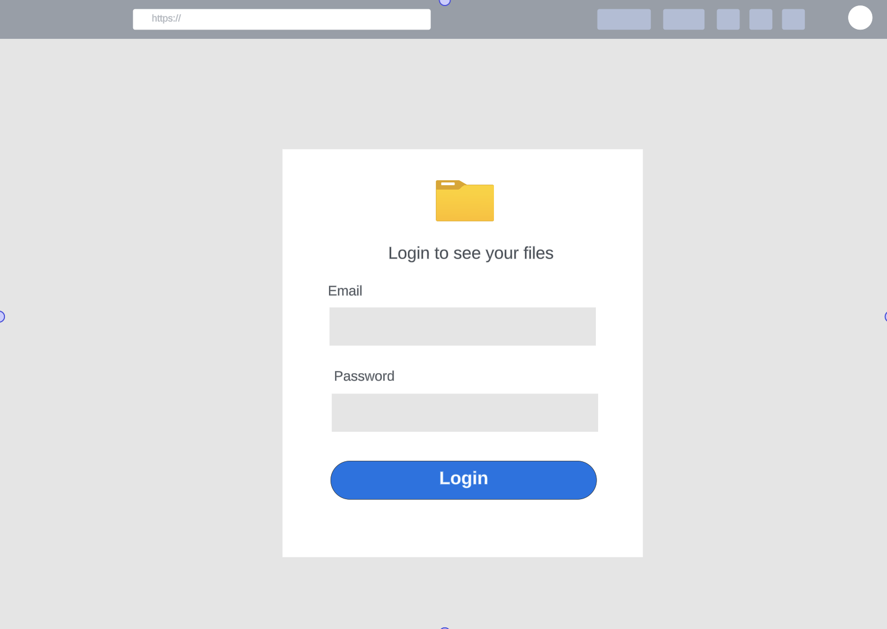
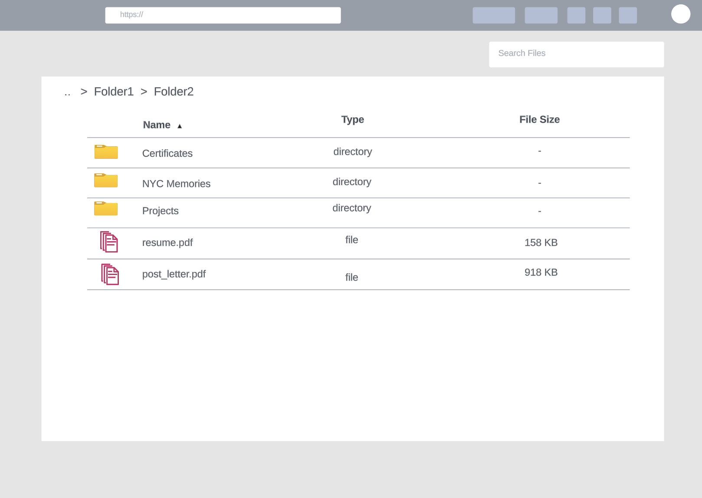
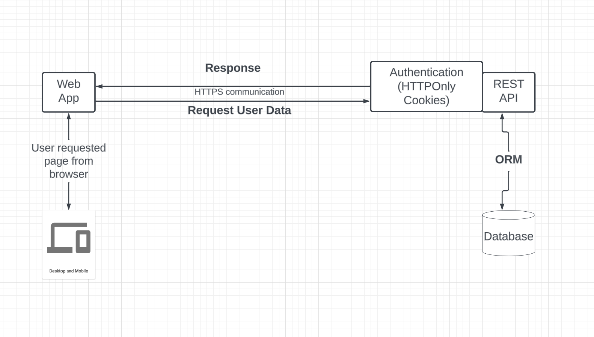

# Cartolinks App - Technical Design Document

## Introduction
This application is used to help user easily access and store their files securely in the cloud.

## UI/UX
The app should provide a simple yet elegant UI with a seamless experience for users to navigate the app with little to no tutorials.
####  The login page

####  Files page

## User stories
To achieve the minimum viable product a user must be able to do the following:
* Login to the app by providing their registered email address and password
* After successfully logging in, a user should be able to view their file in a table and navigate through the folders content back and forth seamlessly

## System Architecture Strategy
To ensure security, we will be storing the user sessions on the server, using HTTPOnly cookies to help protect against cross-site scripting (XSS) attacks. 

